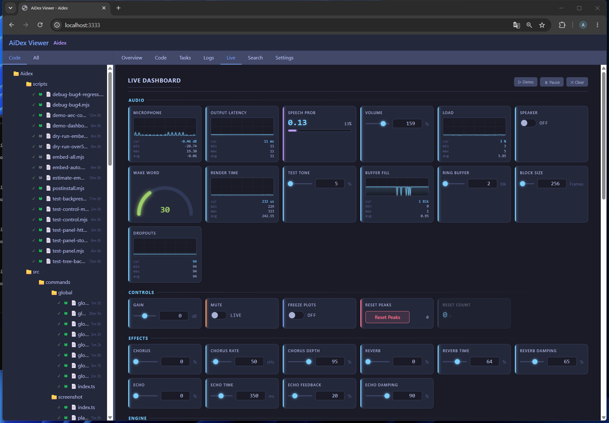
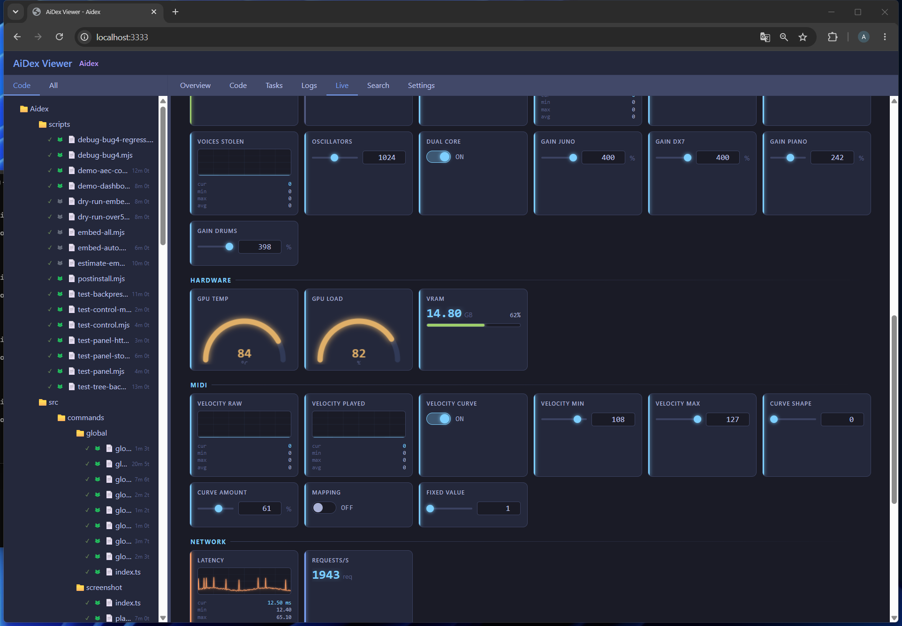
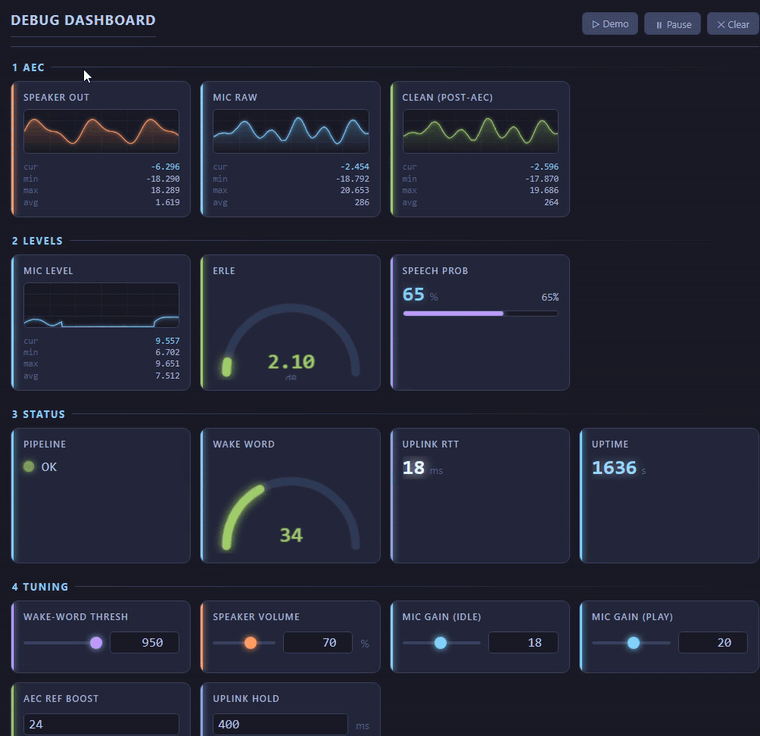

# LogHub Panel-Dashboard — Anleitung

> 🌐 **Generisch — keine Plattform vorausgesetzt.** Das Dashboard ist eine reine
> HTTP-Schnittstelle. Quelle kann **alles** sein, was POSTs senden kann: ein
> Python-Skript, eine C#-/WinForms-App, ein Node-Server, Shell + `curl`, der
> Browser, ein Mikrocontroller. Der Store weiß nichts über die Bedeutung der
> Werte. Wo unten ein ESP32 / der GeminiPod auftaucht, ist das **nur ein Beispiel**
> für eine Quelle — keine Voraussetzung. Bilder-Quelle ist zufällig das
> GeminiPod-Dashboard (ESP32 „Sophia"), weil es viele Widget-Typen gleichzeitig zeigt.
>
> 📎 **Single Source of Truth** für die Feld-Referenz ist `src/loghub/panel-types.ts`
> (`PanelHttpEntry`); die HTTP-Endpunkte stehen in `src/loghub/log-server.ts`. Wenn
> der Code sich ändert, gilt der Code — diese Seite nachziehen.

---

## 1. Was ist das Panel-Dashboard?

Der **Log-Stream** im Viewer ist eine Chronik: jede Zeile scrollt nach oben weg.
Das ist perfekt für Ereignisse („Verbindung aufgebaut", „Datei geladen", „Fehler X"),
aber unbrauchbar für **Werte, die sich ständig ändern**. Ein Audio-Pegel, der 50-mal
pro Sekunde gemeldet wird, würde den Stream fluten und wäre trotzdem nie ablesbar.

Genau dafür ist das **Panel-Dashboard** da. Es ist die zweite Ansicht im selben
Logs-Tab (oben umschaltbar zwischen *Stream* und *Dashboard*) und funktioniert nach
einem anderen Prinzip:

- **Feste Kacheln statt Scroll.** Jedes Widget hat eine `id`. Sendest du dieselbe `id`
  erneut, wird der Wert **an Ort und Stelle überschrieben** — die Kachel bleibt stehen,
  nur die Zahl/der Balken aktualisiert sich. Damit kannst du beliebig hochfrequent
  senden, ohne irgendetwas zuzumüllen.
- **Gedacht für laufende Messwerte:** Audio-Pegel, Puffer-Füllstand, FPS, freier Heap,
  WLAN-RSSI, Temperatur, Status-LEDs — alles, was du normalerweise nur mühsam aus
  Log-Zeilen herauslesen würdest.
- **Zwei Richtungen.** Die meisten Widgets sind **Anzeige** (Quelle → AiDex). Vier
  Typen — `slider`, `number`, `toggle` und `button` — sind **interaktiv**: AiDex rendert
  ein Bedienelement, der User betätigt es, und der neue Wert fließt **zurück an die
  Quelle** (→ Sektion 3b). Damit steuert man eine laufende App live vom Browser aus:
  Werte einstellen (Regler, Zahl), etwas an-/ausschalten (Schalter), etwas auslösen
  (Taster).
- **Durchgängiges Prinzip: der Sender entscheidet, AiDex rendert nur.** Skala, Farbe,
  Einheit, Nachkommastellen — all das bestimmt die Quelle. Der Viewer hat keine eigene
  Logik, er zeigt an, was ankommt.
- **Zero-cost und library-frei.** Solange du nichts sendest, existiert kein Widget.
  Der Empfänger ist reines HTTP — **kein SDK, keine Bibliothek, kein Build-Schritt.**
  Ein `curl` reicht.



In der Gruppe **Controls** steht je ein Vertreter aller interaktiven Typen nebeneinander:
ein Regler (*Gain*), zwei Schalter (*Mute*, *Freeze Plots*) und ein Taster
(*Reset Peaks*) mit seinem Druck-Zähler daneben.

Weiter unten auf demselben Dashboard senden **mehrere Quellen gleichzeitig** — eine
Synth-Firmware und ein Demo-Skript, ohne voneinander zu wissen. Der Hub kennt die
Bedeutung der Werte nicht, deshalb stört sich nichts daran:



> ▶️ **In Bewegung:** [loghub-dashboard.gif](loghub-dashboard.gif) zeigt das Dashboard live —
> die Tuning-Slider werden verstellt und die Waveform-Plots reagieren in Echtzeit.
> (Volles Video: [loghub-dashboard.mp4](loghub-dashboard.mp4).) Das gezeigte Board ist
> eine AEC-Tuning-Konsole nach dem Vorbild des GeminiPod-Satelliten.
> ⚠️ GIF und Video zeigen noch den alten Reiternamen „Debug" — die Standbilder oben
> sind aktuell.

---

## 2. Schnellstart (3 Schritte)

1. **LogHub starten** — der HTTP-Empfänger läuft auf Port **3335**:

   ```
   aidex_log({ action: "init" })
   ```

2. **Viewer öffnen** und auf den Logs-Tab → *Dashboard* umschalten:

   ```
   aidex_viewer({ path: "." })
   ```

3. **Erstes Widget senden.** Ein `POST /panel` legt die Kachel an *und* setzt den Wert
   in einem Aufruf (Upsert). Hier eine einfache Text-Kachel:

   ```bash
   curl -X POST http://localhost:3335/panel \
     -H "Content-Type: application/json" \
     -d '{"id":"status","type":"label","value":"running","group":"Demo","label":"State"}'
   ```

   Die Kachel „State" erscheint sofort im Dashboard. Schickst du denselben `id` noch
   einmal mit einem anderen `value`, ändert sich nur der angezeigte Text — die Kachel
   bleibt:

   ```bash
   curl -X POST http://localhost:3335/panel \
     -H "Content-Type: application/json" \
     -d '{"id":"status","value":"paused"}'
   ```

   > Beim zweiten Aufruf fehlt `type` — das ist Absicht. `type` braucht nur das **erste**
   > Senden zum Anlegen; danach genügen `id` + `value` fürs Update.

`[BILD: leeres Dashboard → erstes Widget erscheint]`

---

## 3. HTTP-API

Alles läuft über `http://localhost:3335`. Jeder Request ist `Content-Type:
application/json`. Es gibt keine Authentifizierung und keinen Zustand zwischen
Verbindungen — jeder POST steht für sich.

### 3a. Anzeige-Endpunkte

| Methode & Pfad | Zweck |
|---|---|
| `POST /panel`   | Ein Widget anlegen **oder** aktualisieren (beides per Upsert über die `id`). |
| `POST /panels`  | Array von Widgets in einem Rutsch (Batch — ein POST pro Dashboard-Tick). |
| `POST /panel/clear` | Body `{}` = **alle** Widgets löschen, `{"id":"x"}` = nur eines. Räumt zugehörige Controls mit weg (s.u.). |
| `GET /health`   | Status-Check (Server lebt, Buffer-Auslastung). |

- **Arbeitsmuster:** einmal alle **Definitionen** senden (mit `type`, `group`, `label`,
  Skala/Farbe), danach im Betrieb nur noch schlanke `{"id":…, "value":…}`-Updates.
  Weil `POST /panel` ein Upsert ist, braucht das Update kein `type` mehr.
- **Unbekannte JSON-Felder werden still verworfen.** Nur die in Sektion 5 gelisteten
  Felder landen im Store. Ein Tippfehler im Feldnamen ist also kein Fehler, hat aber
  auch keine Wirkung — im Zweifel die Feld-Referenz gegenchecken.

### 3b. Control-Rückkanal (interaktive Widgets)

Die Widget-Typen `slider`, `number`, `toggle` und `button` sind **interaktiv**: AiDex
rendert ein Bedienelement, und wenn der User es betätigt, fließt der neue Wert
**zurück an die Quelle**. Das ist der einzige Weg, auf dem Daten von AiDex zurück zur
App laufen — ansonsten ist alles Einbahnstraße (Quelle → AiDex). Der Mechanismus ist
bewusst dumm und quell-agnostisch: ein flacher `{ id: value }`-Speicher, der nichts
über die Bedeutung der Werte weiß.

**Zustand vs. Ereignis — der wichtige Unterschied:**

- `slider`, `number`, `toggle` sind **Zustand**. Der Wert steht einfach da; wer ihn
  später liest, bekommt trotzdem die richtige Antwort.
- `button` ist ein **Ereignis**. Ereignisse gehen bei einem Poll-Modell verloren:
  drückt der User zwischen zwei Abfragen der Quelle, wäre ein einfaches Ja/Nein-Flag
  längst wieder zurückgesetzt. Deshalb ist der Wert eines `button` ein **monoton
  steigender Zähler**. Die Quelle merkt sich den zuletzt gesehenen Stand und liest an
  der Differenz ab, **dass** und **wie oft** gedrückt wurde — auch bei fünf Klicks
  zwischen zwei Polls.

| Methode & Pfad | Zweck |
|---|---|
| `POST /control` | Setzt einen Control-Wert. Body `{ id, value }`. Schreibt in den Control-Store **und** spiegelt den Wert auf die Kachel (alle offenen Viewer sehen die Änderung). Das ruft der **Viewer** auf, wenn der User am Regler zieht oder einen Schalter umlegt. |
| `POST /control/press` | Meldet **einen Tastendruck**. Body `{ id }` — ohne Wert. Der **Hub** zählt hoch, nicht der Aufrufer: bei zwei offenen Dashboards würden beide denselben Folgewert schicken und ein Druck ginge verloren. Antwort enthält den neuen Zählerstand. |
| `GET /control`  | Liefert den ganzen Store als flaches `{ id: value }`-Objekt. **Das pollt die Quelle**, um die aktuellen Set-Points zu erfahren. |

**Zähler richtig auswerten:** Ein `button`-Wert läuft bei 1.000.000 auf 1 über, und
`POST /panel/clear` setzt ihn auf 0 zurück. Die Quelle muss deshalb jeden Sprung
**nach unten** als „Neustart, Wert übernehmen" behandeln — nicht als knapp eine
Million Tastendrücke. Vorwärtssprünge sind echte Drücke.

- **Fluss in vier Schritten:** (1) Quelle definiert ein `slider`-Widget mit Startwert →
  (2) User schiebt den Regler im Viewer → (3) der Viewer schickt `POST /control` →
  (4) die Quelle holt sich den neuen Wert per `GET /control` in ihrem eigenen Takt und
  reagiert darauf (z.B. einen Schwellwert anpassen).
- **Die Quelle ist dieselbe wie beim Senden der Anzeige-Werte** — irgendein
  HTTP-fähiges Programm. Im GeminiPod-Beispiel ist es der ESP32, der so seinen
  Barge-In-Schwellwert live tunen lässt; genauso gut wäre es ein Python-Loop am PC.
- **Aufräumen:** Es gibt **keinen** eigenen `/control/clear`-Endpunkt. `POST /panel/clear`
  entfernt das Widget **und** seinen Control-Wert gemeinsam (sie gehören zusammen).

Ein `slider` anlegen und seinen Wert pollen — minimal mit `curl`:

```bash
# 1) Control-Widget definieren (Startwert 40, Bereich 0..100, Schrittweite 5)
curl -X POST http://localhost:3335/panel \
  -H "Content-Type: application/json" \
  -d '{"id":"threshold","type":"slider","value":40,"min":0,"max":100,"step":5,"group":"Tuning","label":"VAD-Schwelle"}'

# 2) ... User schiebt den Regler im Viewer ...

# 3) Aktuelle Set-Points abholen — liefert z.B. {"threshold":55}
curl http://localhost:3335/control
```



*Die `4 Tuning`-Slider unten werden verschoben (Speaker volume, AEC ref boost …) — die
Plots in `1 AEC` reagieren sofort. Genau dieser Rückkanal ist gemeint: der Wert fließt
vom Viewer zurück an die Quelle.*

---

## 4. Widget-Typen (`type`)

Sechs Typen, in zwei Gruppen. Das `type`-Feld wird nur beim **Anlegen** gebraucht;
danach reicht `id` + `value`.

**Anzeige (Quelle → AiDex):**
- **`label`** — Text/Zahl als Wert. Mit `state` als farbige LED nutzbar.
- **`progress`** — horizontaler Balken, `min`..`max`, `warn`/`crit`-Schwellen → Farbzonen.
- **`gauge`** — Radial-Gauge (Afterburner-Style), `min`..`max`, `warn`/`crit`. Auch als
  LED-Feld: `state` = Farbe (`ok`/`warn`/`error`/…), `value` = freier Text.
- **`plot`** — Linien-Graph (HWiNFO/Afterburner-Style) mit History-Ring
  (`PLOT_HISTORY` = 200 Samples). Footer: cur/min/max/avg. Wert-Update: einzelne Zahl
  (an Ring anhängen) **oder** Array (ganzer Frame ersetzt die History).

**Interaktiv (User im Viewer → zurück an die Quelle, via Control-Store — NEU):**
- **`slider`** — Schieberegler. Felder: `min`/`max`/`step`/`value`/`label`/`group`/`order`.
- **`number`** — Zahlen-Eingabe. Gleiche Felder. Beide schreiben per `POST /control` zurück.
- **`toggle`** — Schalter (Zustand), Wert `0` oder `1`. Optionale Beschriftung beider
  Stellungen über `unit` im Format `"AN|AUS"` (default `ON`/`OFF`). Schreibt per
  `POST /control` zurück.
- **`button`** — Taster (Ereignis). Der Wert ist ein **Druck-Zähler**, kein Flag —
  siehe Abschnitt 3b. `value` beim Anlegen wird ignoriert, der Zähler startet
  immer bei `0`. Beschriftung kommt aus `label`. Schreibt per `POST /control/press`.

`[BILD: je ein Beispiel pro Typ nebeneinander — inkl. slider/number]`

---

## 5. Widget-Felder — vollständige Referenz

Jedes Feld ist optional außer `id` (immer Pflicht) und `type` (Pflicht **nur beim
Anlegen**). Was ein Feld bewirkt, hängt vom Widget-Typ ab — die Spalte „Gilt für"
sagt, wo es wirkt; bei anderen Typen wird es ignoriert. Abgeglichen gegen
`PanelHttpEntry` in `src/loghub/panel-types.ts`.

| Feld | Typ | Gilt für | Bedeutung |
|---|---|---|---|
| `id`      | string         | **alle (Pflicht)** | Eindeutiger Schlüssel. Gleiche id = Update in place. |
| `type`    | string         | **erstellen (Pflicht)** | `label`/`progress`/`gauge`/`plot`/`slider`/`number`/`toggle`/`button`. Nur beim Anlegen nötig. |
| `value`   | number\|string\|number[] | alle | Aktueller Wert. Bei `plot`: Zahl = anhängen, Array = ganzer Frame. Bei `toggle`: `0`/`1`. Bei `button` **ignoriert** — der Zähler startet immer bei 0. |
| `group`   | string         | alle | Gruppen-Box. Viewer sortiert Gruppen **alphabetisch** → Zahlen-Präfix (`"1 Boot"`, `"2 Audio"`) erzwingt Reihenfolge. |
| `label`   | string         | alle | Anzeigename der Kachel. |
| `unit`    | string         | alle | Einheit (z.B. `dB`, `%`, `ms`). Bei `toggle`: Beschriftung beider Stellungen als `"AN|AUS"`. |
| `min`     | number         | progress/gauge/plot/slider/number | Skala/Range-Untergrenze. |
| `max`     | number         | progress/gauge/plot/slider/number | Skala/Range-Obergrenze. |
| `step`    | number         | **slider/number** | Schrittweite pro Tick (default 1). |
| `warn`    | number         | gauge/progress | Schwelle → gelbe Zone. |
| `crit`    | number         | gauge/progress | Schwelle → rote Zone. |
| `color`   | string         | alle | Accent-Name (`cyan`/`green`/`orange`/`purple`/…) oder Hex. |
| `order`   | number         | alle | Sortierung innerhalb der Gruppe. |
| `state`   | string         | gauge/label | **LED-Farbe getrennt vom `value`-Text** (`ok`/`warn`/`error`/…). Farbige LED + lesbarer Text gleichzeitig. |
| `scale`   | string         | **plot** | Y-Achse: `"linear"` (default) \| `"log"`. → Sektion 6. |
| `decimals`| number         | **plot** | Nachkommastellen im Footer (0 = ganzzahlig). |
| `autoMin` | boolean        | **plot** | Untergrenze folgt dem Daten-Minimum (Decke bleibt `max`). → Sektion 6. |

> Hinweis: `step`, `scale`, `decimals`, `autoMin` sind alle **sender-gesteuert** —
> der Renderer rendert nur, was ankommt.

---

## 6. Plot-Skalierung im Detail

Der Plot ist der anspruchsvollste Widget-Typ, weil seine Y-Achse über die Lesbarkeit
entscheidet. Vier Stellschrauben, alle **sender-gesteuert**:

- **Autoskala (Standard).** Lässt du `min`/`max` weg, skaliert der Plot fortlaufend auf
  den Inhalt der History (+10 % Luft). Bequem — aber ein einzelner Riesen-Peak drückt
  danach die ganze normale Kurve platt an den unteren Rand.
- **Feste Skala.** Setzt du `min` **und** `max`, steht die Achse still. Kleine
  Schwankungen lassen den Plot nicht mehr zappeln, und Werte außerhalb des Bereichs
  werden geclamped statt aus dem Canvas zu laufen. Erste Wahl, sobald du den
  Wertebereich kennst.
- **Log-Skala** (`scale:"log"`). Für Signale mit großer Dynamik — Audio-Pegel, alles
  dB-artige. Leises Sprechen und ein lauter Peak werden gleichzeitig sichtbar, weil die
  Achse logarithmisch staucht. Die Grenzen werden dabei auf ≥ 1 gehoben (log von 0 gibt
  es nicht).
- **`autoMin`** (`true`). Hebt den „toten" Bereich unterhalb des Grundrauschens weg: die
  Untergrenze folgt dem tatsächlichen Daten-Minimum (die **Decke** bleibt fest auf
  `max`). So sitzt das Grundrauschen am unteren Rand und die volle Plot-Höhe steht dem
  eigentlichen Signal zur Verfügung.

> **Rezept für einen Audio-Pegel-Plot:** `scale:"log"` + `autoMin:true` + `max` =
> Vollausschlag + `decimals:0`. Das war das Kern-Learning aus dem GeminiPod-Einsatz —
> erst diese Kombination machte den Mic-Pegel über die ganze Lautstärke-Spanne ablesbar.

`[BILD: Vorher/Nachher — linear-Autoskala (Peak erschlägt alles) vs log+autoMin
(Rauschen unten, Signal sichtbar)]`

---

## 7. Footer (cur/min/max/avg)

Jeder Plot zeigt unter der Kurve vier Kennzahlen über die sichtbare History:
**cur** (aktueller Wert), **min**, **max** und **avg** (Durchschnitt). Sie stehen
vertikal gestapelt — so werden sie nie abgeschnitten, egal wie schmal die Kachel ist.

Die Anzahl der Nachkommastellen steuerst du mit `decimals`: `0` für ganze Zahlen
(z.B. Pegel, FPS), `1`–`2` für feinere Größen. Der Footer übernimmt diesen Wert
automatisch — du musst die Zahlen nicht selbst formatieren.

---

## 8. Best Practices / Stolpersteine (aus echtem Einsatz)

Die folgenden Punkte sind alle aus echtem Dashboard-Betrieb (u.a. dem GeminiPod auf
ressourcenarmer ESP32-Hardware) entstanden — sie ersparen die typischen ersten Fehler:

- **Definitionen vor Live-Werten:** erst `/panels` mit allen Defs, dann Updates.
- **Batch nutzen (`/panels`):** EIN POST pro Dashboard-Tick statt vieler einzelner.
- **Senden vom Echtzeit-Pfad entkoppeln:** HTTP-POSTs blockieren. Aus zeitkritischen
  Schleifen (Audio-Callback, Render-Loop, ISR) NICHT direkt senden — stattdessen ein
  eigener Dashboard-Task/Thread mit fester Rate (z.B. 5–10 Hz). Gilt überall, ist auf
  ressourcenarmen Quellen (z.B. einem MCU) nur besonders spürbar.
- **Peak-Hold für kurze Events:** wenn der Sende-Takt langsamer ist als das Ereignis,
  das MAX seit dem letzten Tick senden (Reset beim Auslesen), sonst verschluckt der
  Plot kurze Peaks zwischen zwei Ticks.
- **Gruppen-Reihenfolge** über Zahlen-Präfix im `group`-Namen erzwingen.
- **Dynamische Skala vom Sender:** Gesamtwerte, die erst zur Laufzeit bekannt sind
  (z.B. Gesamt-Heap), in die Definition rechnen + in den Titel („Heap frei (von N)").
- **Anlaufverzögerung:** bei Plots mit Auto-History die ersten ein bis zwei Sekunden
  Einschwing-Werte überspringen, sonst dominiert ein Boot-Peak die History.
- **`state` vs `value`:** für farbige Status-LEDs `state` (Farbe) und `value` (Text) trennen.
- **Controls entkoppeln:** `GET /control` im eigenen Takt pollen, nicht synchron zum
  Senden — der Set-Point ändert sich selten, das Polling darf langsam sein.

---

## 9. Vollständiges Beispiel

Ein kleines Audio-Pegel-Dashboard, das alle Bausteine zeigt: einmaliges Anlegen aller
Widgets per Batch (inkl. eines `slider` zum Live-Tuning), zyklische Wert-Updates und
das Zurücklesen des Slider-Werts. Das Beispiel ist in Python, weil das kompakt liest —
es ist aber **reines HTTP** und in jeder Sprache identisch (nur die POST-Syntax ändert
sich).

**Schritt 1 — alle Widgets einmal definieren (`POST /panels`, ein Batch):**

```python
import requests, time, math
HUB = "http://localhost:3335"

# Eine Definition pro Widget. Gruppen mit Zahlen-Präfix → feste Reihenfolge.
requests.post(f"{HUB}/panels", json=[
    # Plot mit dem Audio-Rezept aus Sektion 6 (log + autoMin + feste Decke).
    {"id":"mic","type":"plot","group":"1 Audio","label":"Mic Pegel","unit":"dB",
     "min":0,"max":90,"scale":"log","autoMin":True,"decimals":0,"color":"cyan"},
    # Balken für die Puffer-Füllung, mit Schwellen für gelb/rot.
    {"id":"buf","type":"progress","group":"1 Audio","label":"Buffer","unit":"%",
     "min":0,"max":100,"warn":75,"crit":90},
    # Status-LED: Farbe kommt aus state, der Text aus value (Sektion 5).
    {"id":"link","type":"gauge","group":"2 System","label":"Verbindung",
     "state":"ok","value":"connected"},
    # Interaktiver Slider — der Wert fließt zurück an dieses Skript (Sektion 3b).
    {"id":"gain","type":"slider","group":"3 Tuning","label":"Eingangs-Gain",
     "value":50,"min":0,"max":100,"step":5},
])
```

**Schritt 2 — im Betrieb laufend Werte senden und den Slider zurücklesen:**

```python
gain = 50
while True:
    level = measure_mic_db()          # deine Messung
    buf   = ring_buffer_fill_pct()

    # Ein Batch pro Tick — ein POST statt vieler einzelner.
    requests.post(f"{HUB}/panels", json=[
        {"id":"mic", "value":level},   # Zahl → wird an die Plot-History angehängt
        {"id":"buf", "value":buf},
    ])

    # Set-Point in eigenem (langsamerem) Takt abholen — ändert sich selten.
    controls = requests.get(f"{HUB}/control").json()   # z.B. {"gain": 65}
    if "gain" in controls:
        gain = controls["gain"]        # neuen Gain anwenden

    time.sleep(0.1)                    # ~10 Hz Dashboard-Rate
```

Das war's: ein laufendes Dashboard mit Plot, Balken, Status-LED **und** einem Regler,
über den du die App live steuerst — ganz ohne Library, nur HTTP.

`[BILD: das fertige laufende Dashboard]`

---

## 10. Screenshots erstellen — GeminiPod als Demo-Objekt

> Arbeitsnotiz für die Bebilderung (die `[BILD: …]`-Platzhalter oben). Kein Teil der
> Anleitung selbst — beschreibt nur, **wie** die Screenshots entstehen sollen.

- **Bild-Quelle = GeminiPod-Dashboard** (ESP32 „Sophia"). Zeigt alle Widget-Typen in
  einem realen System: Plots (Mic Peak, Speaker, Heap), Progress (Mic RMS, Spk Ring,
  PSRAM), Gauge (RSSI, Heartbeat), Status-LEDs (Wake Active/Detections/Last), Labels
  (Modus, Uptime, Task-Stacks). `[+ falls vorhanden: slider/number-Controls zeigen]`
- **ERST wenn GeminiPod feature-vollständig** und alle Felder leben — insbesondere
  Speaker-Plot **und** Spk-Ring müssen im Normalbetrieb echte Werte zeigen (nicht nur
  kurz bei der „Ja"-Quittung). Also erst nach laufender Gemini-Live-Session mit
  dauerhaftem Streaming-TTS in den Speaker. Vorher wären Speaker-Plot/Ring meist 0.
- **Reihenfolge fürs Bebildern:** (1) GeminiPod fertig (Live-Session + Speaker dauernd
  aktiv), (2) während echter Konversation Region-Screenshots ziehen, (3) Vorher/Nachher-
  Paar der Skalen-Sektion gezielt nachstellen (einmal ohne `scale`/`autoMin`, einmal mit).
- **Capture-Tool:** `aidex_screenshot({ mode: "region" })`.

---

## TODO — noch offen

Text und HTTP-Beispiele sind fertig (gegen den Code abgeglichen, Stand 2026-06-30).
Offen sind nur noch die Bilder und das Verlinken:

- [ ] Screenshots einfügen (`[BILD: …]`-Platzhalter) — Quelle GeminiPod, ERST wenn
      feature-vollständig (Speaker-Plot + Spk-Ring zeigen dauerhaft Werte). Anleitung
      dazu → Sektion 10. Optional: kurzes Demo-GIF (separater Task #24).
- [ ] `slider`/`number`-Control im Demo-Bild zeigen, sobald der GeminiPod-Build es nutzt.
- [ ] Verlinken: in AiDex-`README.md` / `CLAUDE.md` („LogHub Developer Guide") auf diese
      Seite verweisen.
